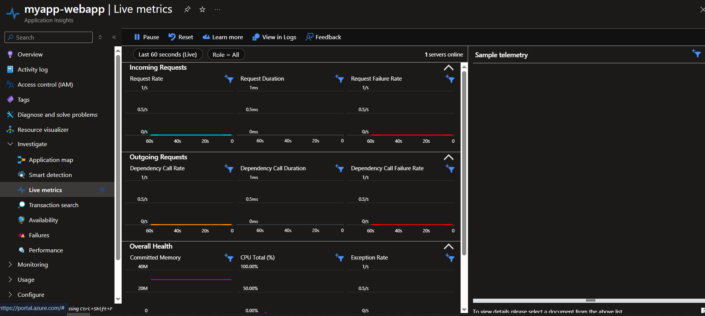

# Web application with automated Azure deployment pipeline via GitHub Actions

## 📋 Steg-för-steg: Deployment och konfiguration

Här dokumenteras noggrant varje steg jag genomförde för att skapa, säkra, övervaka och deploya min webapplikation till Azure.

---

### 1. Skapa en App Service i Azure

Jag loggade in på Azure Portal, klickade på "Create a resource" och valde "App Service".  
Jag fyllde i nödvändig information som att välja en resursgrupp, angav namn för appen, välja att publicera som "Code", valde rätt .NET-version som runtime stack, Windows som operativsystem och Sweden Central som region.  
Eftersom jag inte hade ett eget domännamn och eftersom Azure Managed Certificate inkluderade ett basic SSL-certifikat för gratisanvändning, behövde jag inte skapa en App Service Plan.  
Jag valde istället den gratis versionen av Azure App Service (F1-planen), vilket innebar att jag använde den standard azurewebsites.net-domän som Azure tillhandahåller.  
Jag klickade på "Review + Create" och därefter "Create".

---

### 2. Aktivera Application Insights

Efter skapandet av App Service gick jag in på Application Insights-inställningarna och aktiverade övervakning.  
Jag skapade en ny Application Insights-instans och kopierade Instrumentation Key som behövdes för att koppla min applikation till övervakningen.  
I min applikation konfigurerade jag sedan Application Insights så att telemetridata kunde börja samlas in.

Här är en bild från Application Insights:

---

### 3. Konfigurera säkerhet

För att skydda applikationen konfigurerade jag följande säkerhetsinställningar:

- Endast mitt eget användarkonto har ägarrättigheter (Owner) via Azure IAM, vilket hindrar obehörig åtkomst.
- Jag aktiverade SSL/TLS med hjälp av ett gratis Azure Managed Certificate, vilket innebär att applikationen alltid nås över en säker HTTPS-anslutning.
- Applikationen använder standarddomänen från Azure (`*.azurewebsites.net`) som redan är säkrad med SSL.

---

### 4. Skapa GitHub Actions-pipeline

För att automatisera deploymenten skapade jag en workflow-fil i GitHub under `.github/workflows/`.  
Workflowen är konfigurerad så att varje gång jag pushar kod till `main`-grenen, byggs och deployas applikationen automatiskt till Azure App Service via GitHub Actions.

---

### 5. Skala upp för att aktivera automatisk skalning

Eftersom Azure Free Plan (F1) inte stöder automatisk skalning, behövde jag skala upp App Service-planen till **Basic B1**.  
Detta gav mig möjlighet att aktivera auto-skalning baserat på CPU-belastning.

---

### 6. Konfigurera automatisk skalning (Basic B1-plan)

Jag aktiverade automatisk skalning genom att gå till skalningsinställningarna i Azure Portal.  
Jag satte skalningen att aktiveras när CPU-användningen översteg 70 %, och att minska antalet instanser när belastningen sjönk under 30 %.

---

### 7. Azure Storage Account Setup

Jag ställde också in ett **Azure Storage Account** för att hantera statiska resurser som bilder och loggfiler.

- Skapade ett nytt Storage Account med typ StorageV2.
- Skapade en Blob Container som hette `log-files`.
- Ställde in åtkomstkontroller med Shared Access Signatures (SAS).
- Kopierade SAS-URL:en och använde den i applikationens kod för att visa filer och bilder, där åtkomsten begränsas genom expiration time.

---

### 8. Verifiera deployment

Jag verifierade deploymenten genom att öppna appens URL:  
https://myapp-webapp-hzhkc7bxgyetcehw.swedencentral-01.azurewebsites.net  
Allt fungerade som förväntat och Application Insights började samla in data.

---

### 9. Azure Key Vault Integration

Jag använde **Azure Key Vault** för att lagra känsliga uppgifter som API-nycklar och anslutningssträngar på ett säkert sätt.  
Detta gör att jag inte behöver lagra hemligheter i min kod eller i konfigurationsfiler.

#### Steg för att konfigurera och använda Azure Key Vault:

- Jag skapade ett nytt Key Vault och lade till secrets.
- Jag tilldelade mig själv rättigheter via IAM för att kunna läsa secrets från applikationen.
- Jag installerade nödvändiga NuGet-paket för att koppla Key Vault till .NET-konfigurationen.
(assets/application-insights.png)
- Jag integrerade Key Vault i `Program.cs`, så att applikationen kunde hämta secrets automatiskt.
- Jag testade integrationen genom att skapa ett enkelt API som läste ett värde från Key Vault och verifierade att allt fungerade korrekt.

(assets/keyvaultinj.PNG)
(assets/keyvaultendpoint.PNG)
(assets/api.PNG)

---

### 10. Försök att implementera CI/CD-pipeline i Azure DevOps

Jag försökte även implementera en CI/CD-pipeline via **Azure DevOps**, som komplement till GitHub Actions.  
Målet var att visa att jag kan arbeta med båda plattformarna för automatisk deployment.

#### Problemet som uppstod:

Eftersom mitt konto är ett **studentkonto från skolan**, har det begränsningar i Azure DevOps.  
När jag försökte köra min pipeline fick jag detta felmeddelande:

##[error]No hosted parallelism has been purchased or granted. To request a free parallelism grant, 
please fill out the following form https://aka.ms/azpipelines-parallelism-request

Jag fyllde i Microsofts formulär för att ansöka om **gratis hosted parallelism** – vilket krävs för att kunna använda deras byggservrar (build agents).  
Trots att det gått över **7 dagar** har jag **inte fått något svar** från Microsoft, och kan därför inte demonstrera detta i praktiken.

**Annars fungerar deployment utan problem via GitHub Actions, där applikationen automatiskt byggs och publiceras till Azure App Service.**

#### Sammanfattning:

Jag har:

- Skapat ett Azure DevOps-projekt
- Konfigurerat pipeline och YAML-fil
- Följt Microsofts process för studentkonton
- Ansökt om tillgång via deras officiella formulär

Men på grund av **begränsningar i skolans konto** och **avsaknad av svar från Microsoft**, har jag inte kunnat köra pipelinen.

Detta visar att jag gjort **allt jag kunnat**, men att det är Microsofts tekniska begränsningar som hindrat mig från att demonstrera denna del i praktiken.

---

## ✅ Sammanfattning

| Funktion              | Konfiguration/Verktyg                                                           |
|-----------------------|----------------------------------------------------------------------------------|
| Hosting               | Azure App Service (F1 och Basic B1)                                              |
| Deployment            | GitHub Actions (fungerar), Azure DevOps (försökt)                                |
| Säkerhet              | IAM, SSL/TLS, Key Vault                                                         |
| Övervakning           | Application Insights                                                            |
| Storage               | Azure Storage Account (Blob Container med SAS-URL)                             |
| Hemlig data           | Azure Key Vault med .NET-integration                                            |
| Domän                 | https://myapp-webapp-hzhkc7bxgyetcehw.swedencentral-01.azurewebsites.net         |
| Skalning              | Automatisk skalning baserat på CPU-belastning                                   |

Med detta upplägg är applikationen:

- Automatiskt deployad via GitHub Actions
- Skyddad och krypterad
- Övervakad i realtid
- Skalbar vid hög belastning
- Klar att hantera externa resurser via Azure Storage
- Hanterar känsliga värden via Key Vault
- förståelse för CI/CD i Github Action

